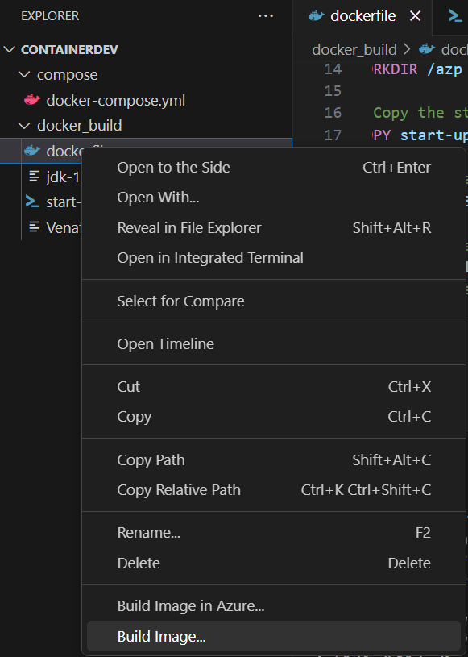
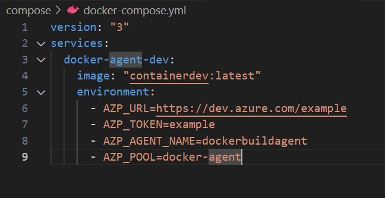

# Venafi CodeSign Protect Task for Azure Pipeline

This task is an Azure Pipeline task that allows you to sign code using Signtool and/or Jarsigner in an Azure Pipeline. This solution is fully containerized, utilizing Docker containers to sign code.

Walkthrough video: https://sidechainsecuritycom.sharepoint.com/:v:/s/Sidechain-Engineering/EXPJ3rN3W9ZHrAXnr_-O4qUBq0vB3V7G-1VRx3wR7f7prg?e=rEEme2

## Setup & usage overview

To use this tool, you will need to spin up a Docker container off of an image that you create. The image will be generated using the provided dockerfile.

In order to use this dockerfile, you must provide a Microsoft Installer (.msi) file of the Venafi Code Signing Clients tool, as well as the JDK-17 installer:

https://www.oracle.com/java/technologies/downloads/#java17

Our Docker container is based off of this .NET Framework SDK image (4.8.1): 

https://hub.docker.com/_/microsoft-dotnet-framework-sdk/

``` mcr.microsoft.com/dotnet/framework/sdk:4.8.1-windowsservercore-ltsc2022 ```

## Compatibility

Stable using Venafi Code Signing Clients version 22.4.0 (x64).

Stable using Jarsigner version: jdk-17

NOTE: When specifying the path to the directory to sign (in your pipeline), please ensure that you point to a directory, and that every file present in the directory is compatible with your signer of choice. For example, when using Jarsigner, please point to a path containing only JAR files.

## Flags

"authurl" | authURL for Venafi CodeSign Protect

"hsmurl" | hsmURL for Venafi CodeSign Protect

"username" | Venafi CSP username

"password" | Venafi CSP password

"filesPattern" | pattern match for files (default is *)

"filesPath" | path to files to sign

"timestampServer" | timestamp server

"timestampAlgo" | timestamp algorithm

"appendSignature" | append signature

"subjectName" | subject name

"additionalArgs" | additional arguments

"certAlias" | certificate alias

"signer" | signer to use

## Usage

First create an image from the dockerfile provided under docker/dockerfile. Ensure you have all the prerequisite files in the same directory (for Venafi CodeSigning and Jarsigner)



Configuire your docker-compose file with relevant Azure secrets, AZP_URL and AZP_TOKEN.
Next, run ``` docker-compose up ``` and ensure that your docker-compose.yaml is pointing to the correct image that you built in the last step. Assuming your azure creds are correct, your docker container should now be looking for jobs



Run your pipeline with the variables you want and see your documents be signed!

## Example tasks


### Sign with Signtool

```
- task: venafi-signing-task@0
  inputs:
    signer: 'signtool'
    authurl: $(authurl)
    hsmurl: $(hsmurl)
    username: $(username)
    password: $(password)
    filesPath: 'Z:\'
    timestampserver: 'http://timestamp.digicert.com'
    timestampalgo: 'SHA256'
    appendsignature: 'TRUE'
    certAlias: 'venafi_svc'
    subjectName: 'venafi_svc'
```

### Sign with Jarsigner

```
- task: venafi-signing-task@0
  inputs:
    signer: 'jarsigner'
    authurl: $(authurl)
    hsmurl: $(hsmurl)
    username: $(username)
    password: $(password)
    filesPath: 'c:\<path to directory of JAR files>'
    timestampserver: 'http://timestamp.digicert.com'
    timestampalgo: 'SHA256'
    appendsignature: 'TRUE'
    certAlias: 'venafi_svc'
    subjectName: 'venafi_svc'
```

# Contributing

This project welcomes contributions and suggestions.  Most contributions require you to agree to a
Contributor License Agreement (CLA) declaring that you have the right to, and actually do, grant us
the rights to use your contribution. For details, visit https://cla.microsoft.com.

When you submit a pull request, a CLA-bot will automatically determine whether you need to provide
a CLA and decorate the PR appropriately (e.g., label, comment). Simply follow the instructions
provided by the bot. You will only need to do this once across all repos using our CLA.

This project has adopted the [Microsoft Open Source Code of Conduct](https://opensource.microsoft.com/codeofconduct/).
For more information see the [Code of Conduct FAQ](https://opensource.microsoft.com/codeofconduct/faq/) or
contact [opencode@microsoft.com](mailto:opencode@microsoft.com) with any additional questions or comments.

# Legal Notices

Microsoft and any contributors grant you a license to the Microsoft documentation and other content
in this repository under the [Creative Commons Attribution 4.0 International Public License](https://creativecommons.org/licenses/by/4.0/legalcode),
see the [LICENSE](LICENSE) file, and grant you a license to any code in the repository under the [MIT License](https://opensource.org/licenses/MIT), see the
[LICENSE-CODE](LICENSE-CODE) file.

Microsoft, Windows, Microsoft Azure and/or other Microsoft products and services referenced in the documentation
may be either trademarks or registered trademarks of Microsoft in the United States and/or other countries.
The licenses for this project do not grant you rights to use any Microsoft names, logos, or trademarks.
Microsoft's general trademark guidelines can be found at http://go.microsoft.com/fwlink/?LinkID=254653.

Privacy information can be found at https://privacy.microsoft.com/en-us/

Microsoft and any contributors reserve all others rights, whether under their respective copyrights, patents,
or trademarks, whether by implication, estoppel or otherwise.
